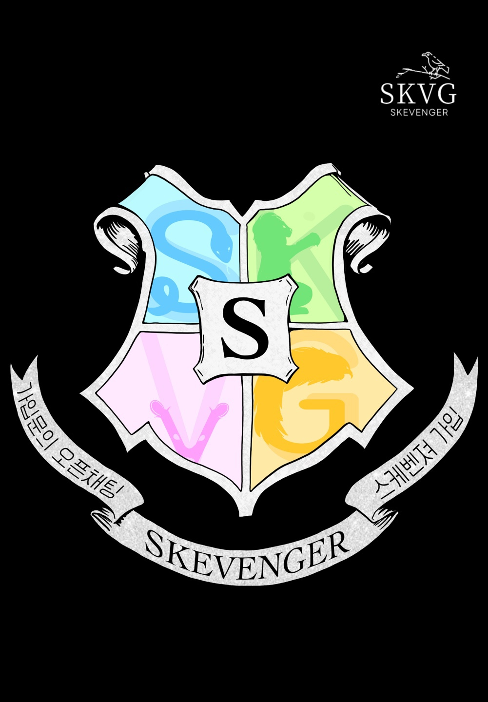

<!DOCTYPE html>
<html>
<head>
    <meta charset="UTF-8">
    <title>Document</title>
</head>
<body>

    <h1> <a href="https://chat.openai.com/?model=gpt-4">gpt</a>를 위한 사이트</h1>
    <p4>사진과 버튼을 눌러보시오</p4>

    
    
    <a href="https://chat.openai.com/?model=gpt-4"><button>gpt 4 링크</button></a>
    <ul>
        <li>항목 1</li>
        <li>항목 2</li>
        <li>항목 3</li>
    </ul>
</body>
</html>
